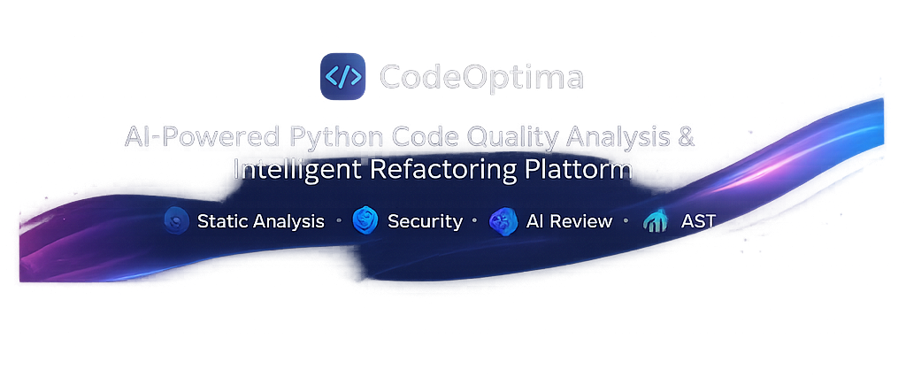
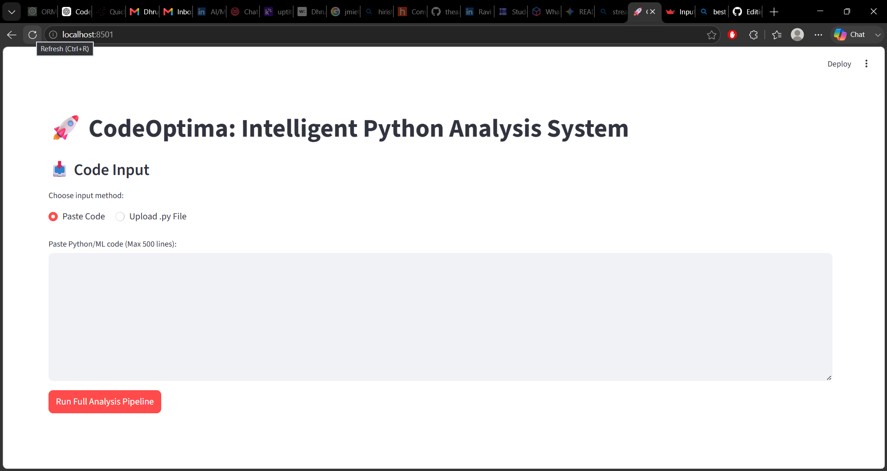
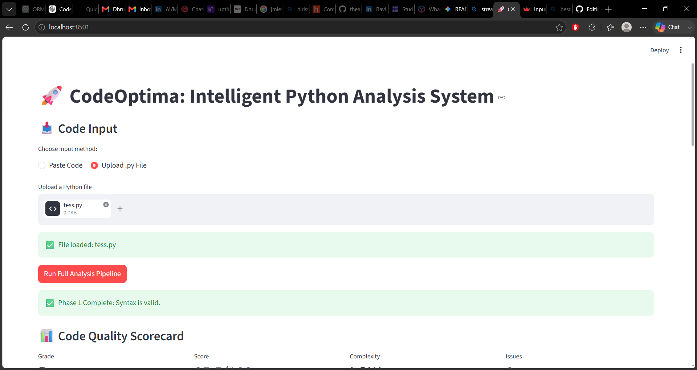
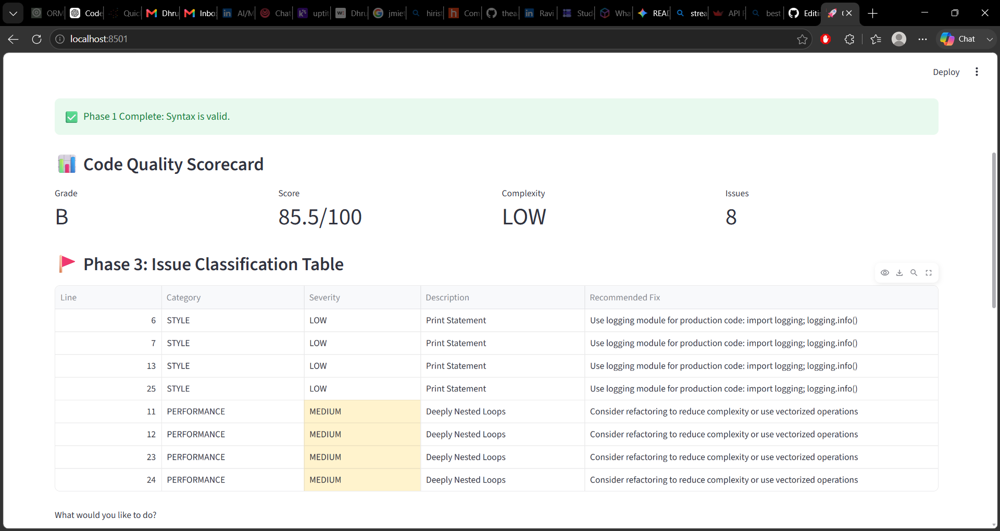
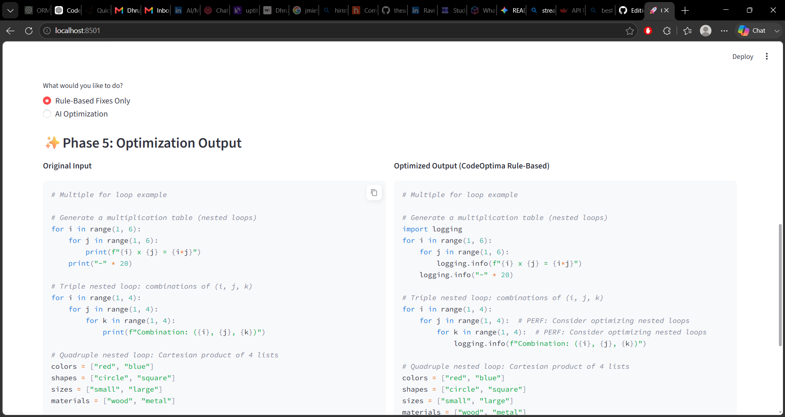
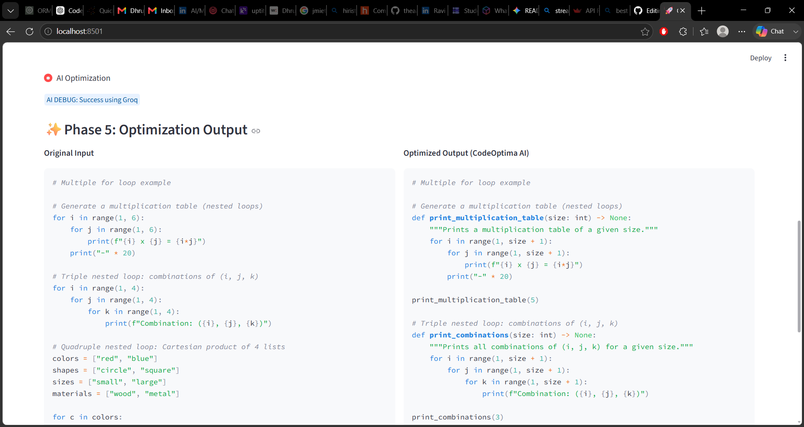
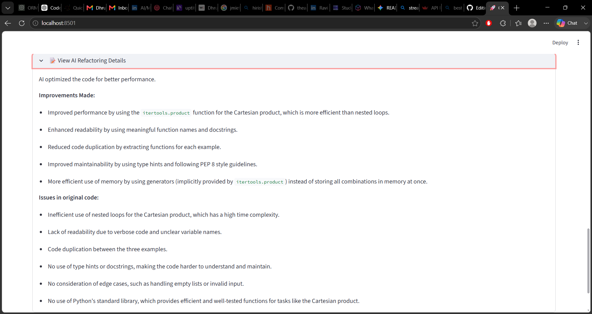
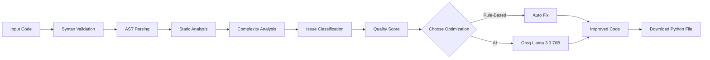

<p align="center">
  
</p>

<h1 align="center">
🚀 CodeOptima
</h1>

<p align="center">
<b>AI-Powered Python Code Analysis & Intelligent Refactoring Platform</b>
</p>

<p align="center">


</p>

---

## 🌟 Overview

**CodeOptima** is an AI-powered Python code quality analysis platform that combines traditional static analysis with modern LLM-powered code optimization.

The application analyzes Python code using Abstract Syntax Trees (AST), detects security vulnerabilities, evaluates code complexity, enforces best practices, calculates an overall quality score, and provides both rule-based fixes and AI-assisted refactoring using **Groq's Llama-3.3-70B-Versatile** model.

Whether you're learning Python, reviewing code, or improving production code quality, CodeOptima provides actionable insights with side-by-side comparisons and detailed explanations.

---
## 🚀 Highlights

- 🧠 AI-powered refactoring using **Groq Llama-3.3-70B-Versatile**
- 🔍 AST-based static code analysis
- 📊 Weighted code quality scoring (Security, Performance, Best Practices, Complexity)
- 🛡️ Security and performance issue detection
- 📂 Paste code or upload Python files
- ⚖️ Side-by-side comparison of original vs. optimized code
- 💾 Download optimized Python code

---

# ✨ Features

<table>
<tr>

<td width="50%">

### 🧠 AI-Powered Refactoring

- Powered by **Groq Llama-3.3-70B-Versatile**
- Generates optimized Python code
- Explains every improvement
- Side-by-side code comparison

</td>

<td width="50%">

### 🔍 Static Code Analysis

- AST-based inspection
- Syntax validation
- Style analysis
- Best practice detection

</td>

</tr>

<tr>

<td>

### 📊 Code Quality Scoring

- Weighted scoring system
- Letter grade (A–F)
- Complexity classification
- Issue summary dashboard

</td>

<td>

### ⚡ Performance Analysis

- Nested loop detection
- Complexity evaluation
- Optimization suggestions
- Refactoring recommendations

</td>

</tr>

<tr>

<td>

### 🛡 Security Checks

- Detects insecure coding patterns
- Highlights risky constructs
- Suggests secure alternatives

</td>

<td>

### 📂 Flexible Input

- Paste Python code
- Upload `.py` files
- Supports files up to 500 lines
- Download improved Python code

</td>

</tr>

</table>


---

# 📸 Application Preview

## 🏠 Home Interface

<p align="center">

</p>

---

## 📂 Upload Python File

<p align="center">

</p>

---

## 📊 Code Quality Dashboard

<p align="center">

</p>

---

## ⚙ Rule-Based Optimization

<p align="center">

</p>

---

## 🤖 AI-Powered Refactoring

<p align="center">

</p>

---

## 📝 AI Refactoring Details

<p align="center">

</p>

<!--  
## 🏗️ System Architecture

```mermaid
flowchart TD

A[Python Code] --> 
<!-- B[Input Handler]

B --> 
<!--C[Syntax Validation]

C --> 
<!--D[AST Parser]

D --> 
<!--E[Static Rule Analyzer]

D --> 
<!--F[Complexity Analyzer]

E --> 
<!--G[Issue Detection]

F --> 
<!--H[Complexity Metrics]

G --> 
<!--I[Code Scoring]

H --> 
<!--I

I --> 
<!--J[Quality Dashboard]

J --> 
<!--K{Optimization}

K -->
<!--|Rule Based| L[Auto Fix]

K -->
<!--|AI| M[Groq Llama 3.3]

L --> 
<!--N[Improved Code]

M --> 
<!--N

N --> 
<!--O[Comparison]

O --> 
<!--P[Download]
```
 -->

---

## 🔄 Analysis Pipeline




---

# 🚀 Getting Started

## Prerequisites

Before running CodeOptima, ensure you have:

- Python **3.11+**
- Git
- A **Groq API Key**

---

## Clone the Repository

```bash
git clone https://github.com/Dhruv-sehra/codeoptima.git
cd codeoptima
````

---

## Create a Virtual Environment

### Windows

```bash
python -m venv venv
venv\Scripts\activate
```

### macOS / Linux

```bash
python3 -m venv venv
source venv/bin/activate
```

---

## Install Dependencies

```bash
pip install -r requirements.txt
```

---

## Configure Environment Variables

Create a `.env` file in the project root.

```env
GROQ_API_KEY=your_api_key_here
```

---

## Launch the Application

```bash
streamlit run app.py
```

The application will automatically open in your browser.

```
http://localhost:8501
```

---

# 💻 How to Use

### 1️⃣ Provide Python Code

Choose one of the following:

* Paste Python code
* Upload a `.py` file

---

### 2️⃣ Run Analysis

Click

```
Run Full Analysis Pipeline
```

CodeOptima will perform:

* ✅ Syntax Validation
* ✅ AST Parsing
* ✅ Static Analysis
* ✅ Complexity Analysis
* ✅ Security Checks
* ✅ Code Quality Scoring
* ✅ Issue Classification

---

### 3️⃣ Choose Optimization Mode

You can choose between:

### Rule-Based Optimization

Uses deterministic rules to improve code quality.

### AI Refactoring

Uses **Groq Llama-3.3-70B-Versatile** to intelligently refactor code while explaining every improvement.

---

### 4️⃣ Review Results

View:

* Overall Code Quality Score
* Grade
* Complexity Level
* Issues Table
* Side-by-Side Comparison
* AI Improvement Summary

---

### 5️⃣ Export

Download the optimized Python code as a `.py` file.


---

# 🛠️ Tech Stack

| Category | Technologies |
|----------|--------------|
| **Language** | Python 3.11 |
| **Frontend** | Streamlit |
| **Static Analysis** | Python AST |
| **AI Model** | Groq Llama-3.3-70B-Versatile |
| **Data Processing** | Pandas |
| **Code Transformation** | astunparse |
| **Configuration** | python-dotenv |
| **Version Control** | Git & GitHub |


---

# 📊 Code Quality Scoring

CodeOptima evaluates Python code using a weighted scoring system designed to balance maintainability, security, and performance.

| Category | Weight |
|----------|-------:|
| 🛡️ Security | **30%** |
| 📖 Best Practices | **25%** |
| ⚡ Performance | **20%** |
| 🔍 Complexity | **25%** |

The final score is converted into a letter grade for quick evaluation.

| Score | Grade |
|-------:|:-----:|
| 90–100 | ⭐ A |
| 80–89 | 🟢 B |
| 70–79 | 🟡 C |
| 60–69 | 🟠 D |
| Below 60 | 🔴 F |


---

# 🛣️ Roadmap

### ✅ Completed

- [x] Python AST Parsing
- [x] Static Code Analysis
- [x] Complexity Analysis
- [x] Security Detection
- [x] Code Quality Scorecard
- [x] Rule-Based Refactoring
- [x] AI Refactoring using Groq
- [x] Upload Python Files
- [x] Download Optimized Python Code
- [x] Side-by-Side Code Comparison

### 🚧 Planned

- [ ] Multi-file Project Analysis
- [ ] GitHub Repository Analysis
- [ ] PDF Report Export
- [ ] HTML Report Export
- [ ] JSON Report Export
- [ ] Docker Support
- [ ] REST API
- [ ] VS Code Extension
- [ ] Multi-LLM Support (OpenAI, Gemini, Claude)


---

# 🤝 Contributing

Contributions, suggestions, and bug reports are welcome.

If you'd like to improve CodeOptima:

1. Fork the repository.
2. Create a new feature branch.
3. Commit your changes.
4. Submit a Pull Request.

Please open an Issue first if you're planning a major feature or architectural change.


---

# 📜 License

This project is licensed under the **MIT License**.

See the `LICENSE` file for more details.


---

# 👨‍💻 Author

**Dhruv Sehra**

AI/ML Engineer | Python Developer | Intelligent Software Systems

- GitHub: https://github.com/Dhruv-sehra
- LinkedIn: https://www.linkedin.com/in/dhruvsehra

If you found this project useful, consider giving it a ⭐ on GitHub.
